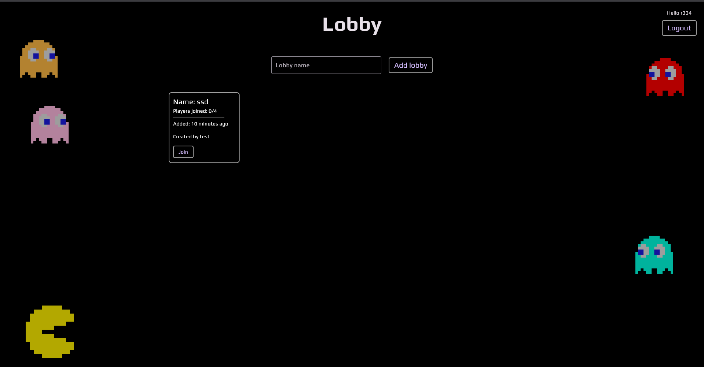
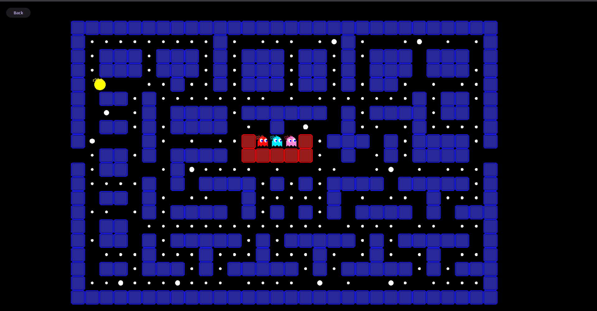

# MazeChase 🎮

A real-time 4-player multiplayer maze chase game built with Phaser.js and Go.

Compete with up to 4 friends in an exciting arena battle - collect pellets, use power-ups, and outlast your opponents!

<div align="center">
  
  
</div>

## 🎯 Game Overview

MazeChase is a competitive multiplayer game where 4 players race through a maze to collect pellets and power-ups while trying to eliminate each other.

### 👥 4 Unique Characters
| Character | Color | Special Ability |
|-----------|-------|-----------------|
| **Azure** | Blue | Swift Runner - 10% faster movement |
| **Crimson** | Red | Tank - Bonus points for eliminations |
| **Jade** | Green | Collector - Bonus points for pellets |
| **Amber** | Orange | Trickster - Faster acceleration |

## ✨ Features & Optimizations

### 🚀 Network Optimizations
- **Message Batching**: 60% reduction in network packets
- **Delta Compression**: 70% bandwidth savings  
- **Rate Limiting**: Token bucket algorithm for DDoS protection
- **Client Prediction**: Zero perceived latency gameplay

### 🎮 Game Features
- **4-Player Multiplayer**: Each player has their own unique character
- **Leaderboard System**: Track wins, scores, and eliminations
- **In-Game Chat**: Real-time messaging with quick-chat
- **Sound System**: Immersive audio with music and effects

### 📱 Mobile Support
- **Touch Controls**: Virtual joystick, swipe gestures, D-pad
- **Responsive UI**: Optimized for all screen sizes

### 🔧 Developer Experience
- **TypeScript Strict Mode**: Full type safety
- **Comprehensive Testing**: Unit & integration tests
- **CI/CD Pipeline**: Automated testing and deployment
- **Monitoring**: Metrics, health checks, structured logging

---

### Core Features

- **Real-time multiplayer gameplay** - Compete with up to 4 friends online
- **WebSocket-powered** - Low-latency communication for smooth gameplay
- **Unique characters** - 4 distinct players with different abilities
- **Easy deployment** - Docker support for quick self-hosting

## Quick Start

### Self-Hosting

#### Using Docker (Recommended)
```bash
docker run -p 11300:11300 mazechase:latest
```

#### Using Docker Compose
```yaml
version: '3.8'
services:
  mazechase:
    container_name: mazechase
    image: mazechase:latest
    ports: 
      - "11300:11300"
    volumes:
      - ./appdata:/app/appdata/
    restart: unless-stopped
```

Then navigate to `http://localhost:11300` in your browser.

## License

This project is open source and available under the [MIT](LICENSE).

## 🛠️ Tech Stack

### Backend
- **Go 1.25** with Melody WebSocket
- **GORM + SQLite** for persistence
- **ConnectRPC** for type-safe APIs
- **zerolog** for structured logging

### Frontend
- **Astro 5.15** + **Phaser 3.90**
- **SolidJS 1.9** for UI components
- **TailwindCSS 4.1** for styling
- **TypeScript 5.7** with strict mode

### DevOps
- **Docker** containerization
- **GitHub Actions** CI/CD
- **Vitest** for testing

## 🧪 Running Tests

```bash
# Backend tests
cd core && go test -v ./...

# Frontend tests
cd ui-web && npm test

# With coverage
npm run test:coverage
```

## 📊 Performance Improvements

| Optimization | Benefit |
|-------------|---------|
| Object Pooling | No GC stutter |
| Frame Rate Control | Consistent 60 FPS |
| Position Interpolation | Smooth movement |
| Server Reconciliation | Accurate sync |

## 🚀 Deployment

### DigitalOcean App Platform

1. Push to your Git repository
2. Connect repo to DigitalOcean App Platform
3. Configure build settings:
   - **Build Command**: `cd core && go build -o bin/server cmd/server/main.go`
   - **Run Command**: `./bin/server`
4. Add environment variables as needed
5. Deploy!

### Manual Server Deployment

```bash
# Clone and build
git clone <your-repo-url>
cd mazechase

# Build backend
cd core && go build -o bin/server cmd/server/main.go

# Build frontend
cd ../ui-web && npm install && npm run build

# Run server
./core/bin/server
```

## Acknowledgments

- Phaser.js community for the excellent game framework
- Go community for libraries and tools
- SolidJS for reactive UI components
